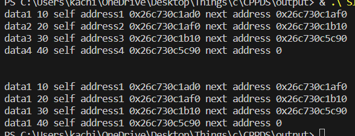

# Singly-Linked-List
A very basic code showcasing Singly Linked List Data Structure in cpp
## Theory
The linked list stores data in sequential storage, like arrays. Though the data are stored sequentially, the memory locations are not contiguous.
Unlike an array, the linked list can store data of different data types.
The below diagram represents the linked-list structure.

## Explaination
This code has the simplest form of linked list implementation and we just link nodes together and print their addresses manually amd using loops.
## Output Screenshot

